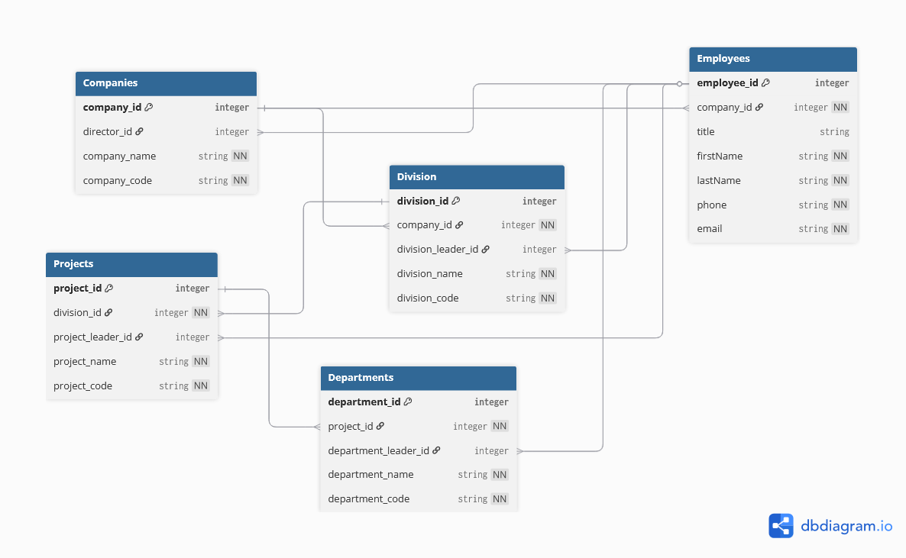

## Technické požiadavky

- [Docker Desktop](https://www.docker.com/products/docker-desktop) (voliteľné)
- [.NET 9 SDK](https://dotnet.microsoft.com/download)
- [SQL Server Express](https://www.microsoft.com/en-us/sql-server/sql-server-downloads) (alebo iná edícia SQL Servera)

---

## Schéma databázy



---

## Spustenie

### Možnosť 1 – Docker

Všetko beží automaticky – SQL Server aj API sa spustia v kontajneroch, databáza sa inicializuje pri prvom štarte.

```bash
docker-compose up --build
```

API bude dostupné na `http://localhost:5000`.  
Scalar dokumentácia: `http://localhost:5000/scalar/v1`

> Pri opätovnom spustení (`docker-compose up`) sa databáza **neinicializuje znova** – dáta sú uložené v named volume `sqlserver-data` a pretrvávajú medzi reštartmi. Dáta sa vymažú iba pri `docker-compose down -v`.

---

### Možnosť 2 – Bez Dockera (lokálny SQL Server)

**1. Inicializácia databázy**

Treba spustiť skript `db/database-init.sql` na lokálnom SQL Serveri. Skript vytvorí databázu `CompanyStructuredb` vrátane tabuliek, constraints, triggerov a ukážkových dát.

**2. Konfigurácia connection stringu**

Uprav connection string v `CompanyStructureApi/appsettings.Development.json`:

```json
"ConnectionStrings": {
  "DefaultConnection": "Server=localhost\\SQLEXPRESS;Database=CompanyStructuredb;Trusted_Connection=True;TrustServerCertificate=True"
}
```

**3. Spustenie API**

```bash
dotnet run
```

API bude dostupné na porte uvedenom v `Properties/launchSettings.json` (predvolene `http://localhost:5041`).  
Scalar dokumentácia: `http://localhost:5041/scalar/v1`

---

## Testovanie (TeaPie)

Testy sa nachádzajú v priečinku `CompanyStructureApi/Tests/`. Pred spustením testov sa uisti, že API beží.

Uprav `host` v `Tests/env.json` podľa toho, na akom porte API počúva:

```json
{
  "$shared": {
    "host": "http://localhost:5041"
  }
}
```

Spustenie všetkých testov:

```bash
teapie test Tests/
```

Testy sú organizované sekvenčne – setup fázy vytvoria testovacie dáta, jednotlivé súbory testujú každý zdroj a záverečný cleanup všetko uprace.

| Súbor | Popis |
|---|---|
| `00-setup-phase1.http` | Vytvorenie testovej spoločnosti a zamestnancov |
| `00-setup-phase2.http` | Priradenie riaditeľa, vytvorenie divízie/projektu/oddelenia |
| `01-companies-tests.http` | CRUD + vyhľadávanie pre spoločnosti |
| `02-employees-tests.http` | CRUD + vyhľadávanie pre zamestnancov |
| `03-divisions-tests.http` | CRUD + vyhľadávanie pre divízie |
| `04-projects-tests.http` | CRUD + vyhľadávanie pre projekty |
| `05-departments-tests.http` | CRUD + vyhľadávanie pre oddelenia |
| `99-cleanup.http` | Vymazanie všetkých testovacích dát |

---

## Architektonické rozhodnutia

### Zakázaný kaskádový delete

Aplikácia zámerne nepovoľuje kaskádový delete. Pri mazaní záznamu (napr. spoločnosti) sa **nevymažú automaticky** všetky jej závislé záznamy (divízie, projekty, zamestnanci a pod.). Toto správanie je dosiahnuté nastavením `DeleteBehavior.Restrict` vo všetkých FK vzťahoch v `CompanyStructureDbContext`.

Dôvod: Považujem za nesprávne, aby vymazanie spoločnosti automaticky zlikvidovalo všetky jej dáta v databáze. Používateľ musí najprv explicitne vymazať závislé záznamy – ide o zámerné ochranné opatrenie proti neúmyselnému hromadnému mazaniu.

### Vytvorenie spoločnosti bez riaditeľa

Každý uzol hierarchie musí mať priradeného vedúceho/riaditeľa, čo je zamestnanec. To však vytvára problém pri zakladaní novej spoločnosti – tá ešte nemôže mať žiadnych zamestnancov. Preto je povolené vytvoriť spoločnosť **bez riaditeľa** a priradiť ho až dodatočne cez PUT endpoint.

### Vracanie celej hierarchie pri GET endpointoch

Pri GET endpointoch pre jednotlivé uzly vraciam celú relevantnú hierarchiu dát. Zadanie bolo primárne zamerané na hierarchickú štruktúru organizačných dát, preto som zvolil tento prístup, aby API poskytovalo kompletný kontext nadväzností medzi entitami bez potreby viacerých doplňujúcich volaní.

### Vágne návratové hlášky a user enumeration

Som si vedomý potenciálneho problému s **user enumeration** – príliš konkrétne chybové správy (napr. „zamestnanec s týmto e-mailom neexistuje" vs. „nesprávne heslo") môžu útočníkovi prezradiť, ktoré záznamy existujú. Preto sú návratové správy nastavené dostatočne vágne. Zároveň sú však stále dostatočne popisné na to, aby sa dalo pohodlne testovať a debugovať správanie API.

### ResponseMapper a načítanie hierarchických dát

Pre hierarchické odpovede (Spoločnosť → Divízie → Projekty → Oddelenia) som použil `ResponseMapper` s EF Core `.Include()` na načítanie vnorených dát. Alternatívou by bola EF Core projekcia cez `.Select()`, ktorá by vyberala iba potrebné stĺpce a bola by výkonnejšia na úrovni SQL dotazu.

Rozhodol som sa pre `.Include()` + `ResponseMapper`, pretože:
- Rozdiel vo veľkosti DTO oproti modelu je minimálny
- Prístup cez `ResponseMapper` výrazne zlepšuje čitateľnosť a udržateľnosť kódu pri hlboko vnorených mapovaniach

Pre zdroje, ktoré hierarchiu neobsahujú (`Employee`, `Department`), je namiesto toho použitá výkonnejšia EF Core projekcia cez `.Select()`, ktorá vyberá priamo iba potrebné stĺpce bez načítavania zbytočných navigačných entít.

---

## Využitie AI

Pri vývoji projektu som využíval AI nástroje (GitHub Copilot) ako asistenciu pri:
- generovaní SQL skriptov (constraints, functions, triggery, seed dáta)
- návrhu a generovaní testovacích scenárov (TeaPie `.http` a `.csx` súbory)

Samotná architektúra API, návrh dátového modelu a implementácia v C# je moja vlastná.
